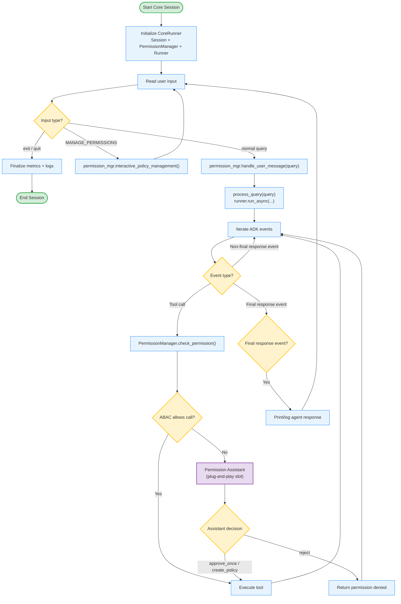
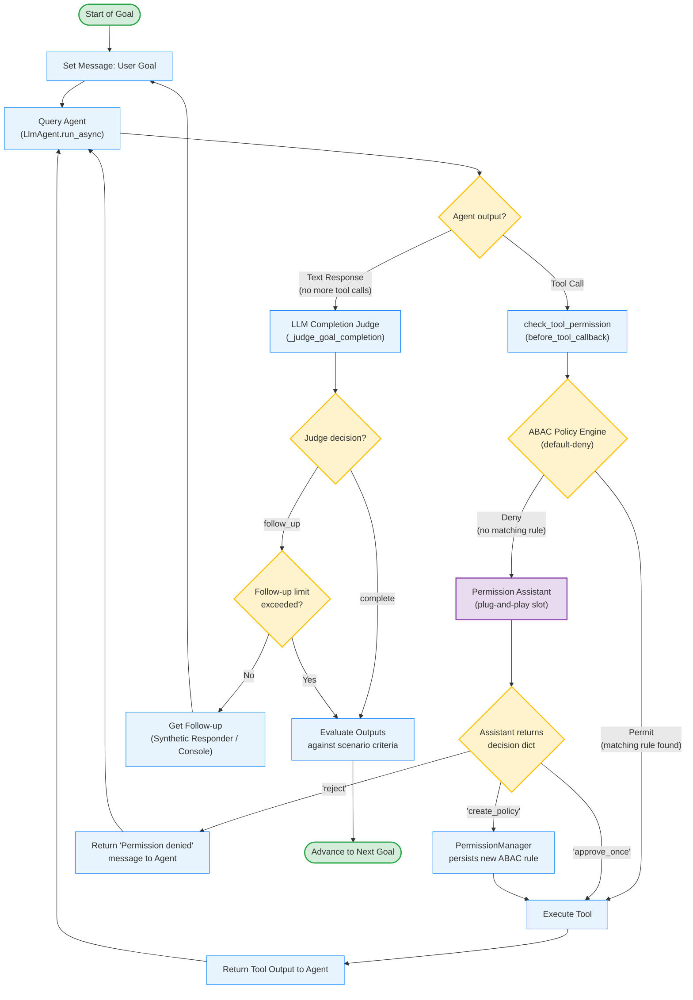
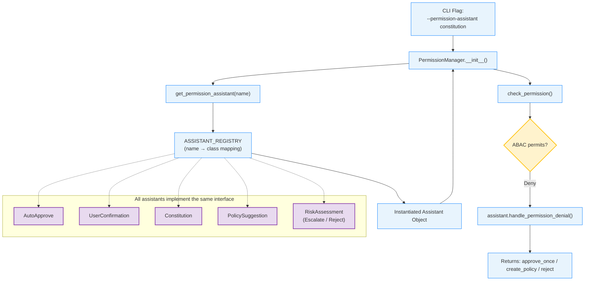
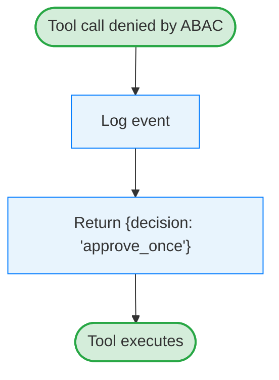
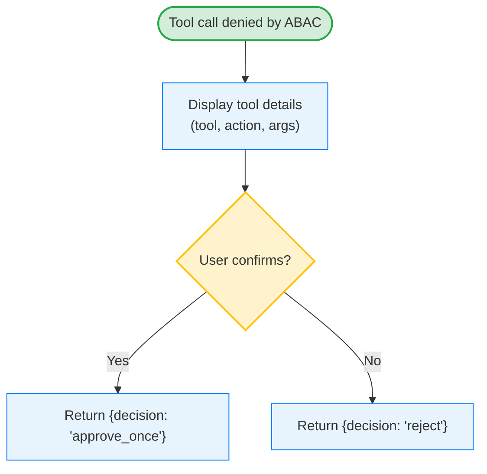
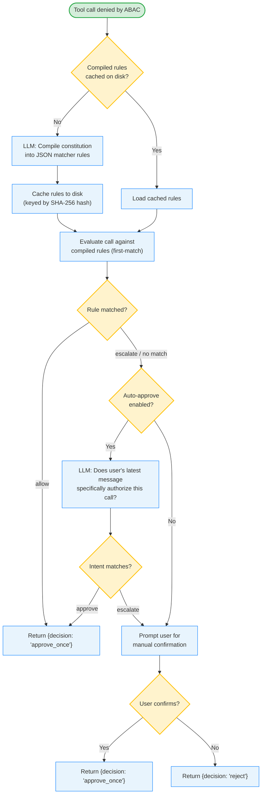
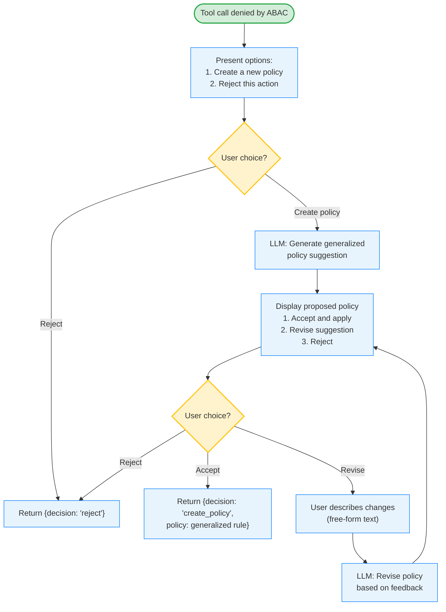
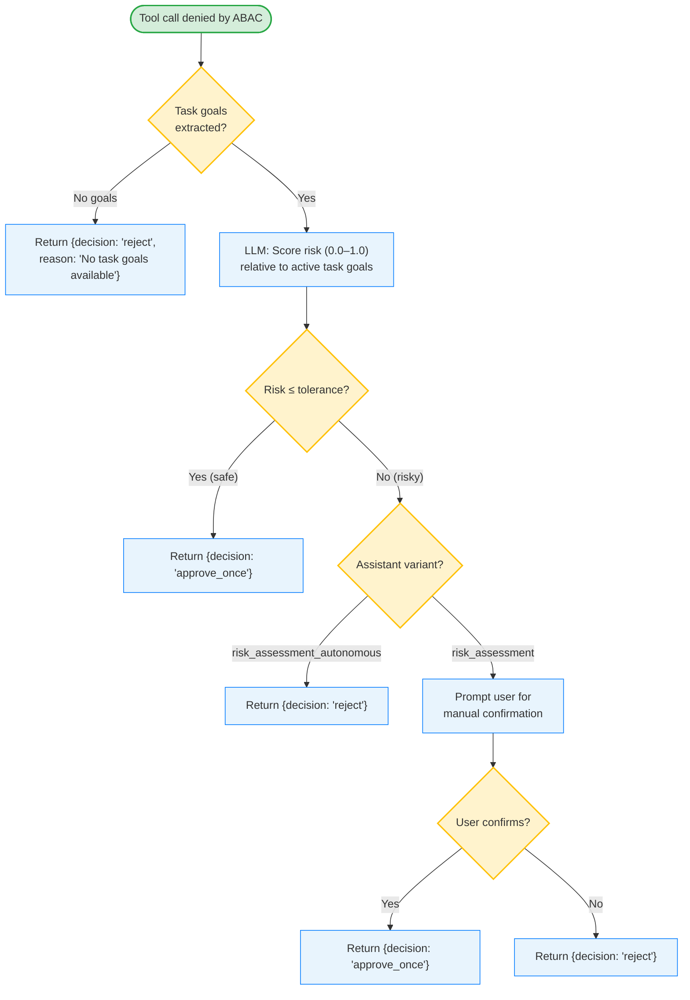

# Agent Controls Framework Architecture & Flow

This document details the architecture and execution logic of the **Permissions Playground** — the Agent Controls Framework. It covers the iterative ReAct planning loop, the plug-and-play permission interception pipeline, and the individual designs, flowcharts, and trade-offs of all **six** permission assistants studied: **Auto-Approve**, **User Confirmation**, **Constitution**, **Policy Suggestion**, **Risk Assessment**, and **Risk Assessment Autonomous**.

---

## 1. Global Architecture Flowchart

The following flowchart shows the high-level runtime for the interactive core runner in `src/scripts/run_core.py`, including where the plug-and-play permission assistant sits in the tool execution path.



### How the Core Loop Works

1. `CoreRunner.start()` initializes in-memory session state, the permission manager, and the ADK runner.
2. Each user turn is classified as `exit`, `MANAGE_PERMISSIONS`, or a normal query.
3. During agent event streaming, any tool call is routed through `PermissionManager.check_permission()` and the default-deny ABAC check.
4. On ABAC deny, the plug-and-play permission assistant decides `approve_once`, `create_policy`, or `reject`; that decision determines whether the tool executes.
5. The loop continues until a final agent response event is received, then the response is printed and the core runner returns to input.
6. The loop repeats until exit, then metrics/logs are finalized.

---

## 2. Evaluation / Scenario Runner Flowchart

The following flowchart traces the execution of a single goal within the scenario runner. The key insight is that the **Permission Assistant** box is a **plug-and-play slot** — the runner and permission manager have no knowledge of which assistant is active. Any assistant that implements `handle_permission_denial` can be swapped in via a command-line flag without changing any other code.



> **Reading the diagram**: The purple node (Permission Assistant) is the plug-and-play slot. Every assistant listed in Section 4 can occupy this slot. They all receive the same inputs and must return the same decision dict format. The PermissionManager handles the rest — persisting policies, returning results to the agent callback, etc.

### How the Evaluation Loop Works

1. **Iterative Execution**: The agent generates tool calls one at a time based on previous results (ReAct pattern). It does not pre-plan all steps.
2. **Default-Deny Gating**: The ABAC policy engine starts empty (unless `--policy-file` is provided), so every tool call is denied by default. This denial is what triggers the permission assistant.
3. **Three Possible Outcomes**: The assistant returns one of three decisions:
   - `"approve_once"` — the tool runs this time, but no rule is saved (future identical calls will be denied again).
   - `"create_policy"` — the tool runs AND a new ABAC rule is persisted, so future identical calls pass the static check silently.
   - `"reject"` — the tool is blocked and a denial message is returned to the agent.
4. **Completion Gating**: Once the agent yields a text response (no more tool calls), an independent LLM judge decides whether the goal is `complete` or needs a `follow_up`.

---

## 3. Plug-and-Play Design Pattern

The framework uses a **decoupled factory-registry pattern** so that permission assistants can be added, removed, or swapped without modifying the execution engine, the policy manager, or any tool definitions.



### Three Key Components

1. **Abstract Base Class** — [BasePermissionAssistant](src/permissions/assistants/base.py#L15)
   - Defines the contract: every assistant must implement `handle_permission_denial(subject, tool_name, action, args, failed_policies) → Dict`.
   - Provides shared utilities: console logging, user prompt hooks, and metrics tracking.

2. **Assistant Registry** — [ASSISTANT_REGISTRY](src/permissions/assistants/registry.py#L28)
   - A dictionary mapping CLI string names to concrete class implementations:
     ```python
     ASSISTANT_REGISTRY = {
         "auto_approve":          AutoApprovePermissionAssistant,
         "user_confirmation":     UserConfirmationPermissionAssistant,
         "constitution":          ConstitutionPermissionAssistant,
         "policy_suggestion":     ToolPolicySuggestionPermissionAssistant,
         "risk_assessment":       TaskPolicyPermissionAssistant,
         "risk_assessment_autonomous": RiskAssessmentAutonomousPermissionAssistant,
     }
     ```

3. **Factory Function** — [get_permission_assistant()](src/permissions/assistants/registry.py#L40)
   - Looks up the name in the registry, instantiates the class with runtime config (risk tolerance, constitution file path, etc.), and returns the object.

### Adding a New Assistant

To add a new permission strategy (e.g., a `slack_notification` assistant), a researcher only needs to:
1. Create a new file subclassing `BasePermissionAssistant`.
2. Implement `handle_permission_denial` returning the standard decision dict.
3. Add one line to `ASSISTANT_REGISTRY`.

No changes are needed to the PermissionManager, the agent, the scenario runner, or any tools.

---

## 4. Detailed Assistant Designs

Each section below shows the internal logic of a single assistant — i.e., what happens inside the purple "plug-and-play slot" from the global flowchart when that assistant is active.

---

### A. Auto-Approve Assistant

* **File**: [auto_approve.py](src/permissions/assistants/auto_approve.py)
* **Design**: Unconditionally approves every denied tool call. No LLM queries, no user prompts.



| Property | Value |
| :--- | :--- |
| Security | **None** — all attacks pass through |
| User prompts | **Zero** |
| LLM calls | **Zero** |
| Policy synthesis | **None** — returns `approve_once` only |
| Use case | Baseline benchmarking, debugging |

---

### B. User Confirmation Assistant

* **File**: [user_confirmation.py](src/permissions/assistants/user_confirmation.py)
* **Design**: Prompts the user for every denied call. On approval, returns `approve_once`, so the tool runs once without persisting a new ABAC rule.



| Property | Value |
| :--- | :--- |
| Security | **Maximum** — every action requires explicit human approval |
| User prompts | **Every denied call** (severe fatigue) |
| LLM calls | **Zero** |
| Policy synthesis | **None** — approvals are one-time only |
| Use case | High-stakes environments, auditing |

---

### C. Constitution Assistant

* **File**: [constitution.py](src/permissions/assistants/constitution.py)
* **Design**: Three-layer defense. First compiles a plain-language constitution document into structured rules (cached by SHA-256 hash). Then optionally verifies user intent via LLM. Falls back to manual confirmation only when both layers fail.



| Property | Value |
| :--- | :--- |
| Security | **High** — governed by written constitution + intent verification |
| User prompts | **Low** — only when no rule matches AND intent check fails |
| LLM calls | **1-2** (compile once, then intent check per denied call) |
| Policy synthesis | **None** — always returns `approve_once`, never persists new ABAC rules |
| Use case | Contractual safety constraints, regulatory compliance |

> **Key distinction**: Unlike User Confirmation, the Constitution assistant never returns `create_policy`. Manual approvals are one-time bypasses. The constitution document remains the sole source of truth.

---

### D. Policy Suggestion Assistant

* **File**: [tool_policy_suggestion.py](src/permissions/assistants/tool_policy_suggestion.py)
* **Design**: Interactive policy co-pilot. Uses an LLM to draft a *generalized* ABAC policy (not just an exact-match clone), then lets the user review, revise, or reject it in a conversational loop.



| Property | Value |
| :--- | :--- |
| Security | **High** — user reviews every rule before it's applied |
| User prompts | **Moderate** — menu choices + optional revision rounds |
| LLM calls | **1+** (initial suggestion + one per revision round) |
| Policy synthesis | **Generalized rules** — broader conditions (regex, `in`, ranges) covering similar future calls |
| Use case | Policy bootstrapping, teaching the system over time |

> **Key distinction**: This is the only assistant where the user actively shapes the *scope* of the generated rule. User Confirmation now grants one-time approvals only; Policy Suggestion creates broader, parameterized rules.

---

### E. Risk Assessment Assistants (Escalate & Reject)

* **Files**: [risk_assessment.py](src/permissions/assistants/risk_assessment.py) (Escalate) and [risk_assessment_autonomous.py](src/permissions/assistants/risk_assessment_autonomous.py) (Reject)
* **Design**: Goal-aware risk scoring. User goals are pre-extracted from each message via `handle_user_message()` (which runs *before* any tool calls). When a denial occurs, the assistant retrieves the already-extracted goals and asks an LLM to score the risk of the tool call relative to those goals.



| Property | Value |
| :--- | :--- |
| Security | **Configurable** — controlled by `--task-assistant-risk-tolerance` (0.0–1.0) |
| User prompts | **Low** (Escalate: only above threshold) / **Zero** (Reject: never prompts) |
| LLM calls | **2** (goal extraction on each message + risk scoring per denied call) |
| Policy synthesis | **None** — approvals are one-time only |
| Use case | High-throughput workflows where low-risk actions should proceed silently |

> **Key distinction**: Goal extraction happens *before* tool calls via `handle_user_message()`, not during the denial handler. The two variants (`risk_assessment` vs. `risk_assessment_autonomous`) differ only in a single method override: `_should_escalate_on_reject()` returns `True` (escalate to user) or `False` (reject silently).

---

## 5. Comparison of All Designs

| Dimension | Auto-Approve | User Confirmation | Constitution | Policy Suggestion | Risk Assessment |
| :--- | :--- | :--- | :--- | :--- | :--- |
| **Primary Goal** | Baseline / debugging | Explicit human gating | Constitution-governed proxy | Interactive policy co-pilot | Goal-aligned risk thresholding |
| **Security** | None | Maximum | High | High | Configurable |
| **User Fatigue** | Zero | Severe | Low | Moderate | Low–Zero |
| **LLM Calls** | 0 | 0 | 1–2 per call | 1+ per call | 2 per call |
| **On Approval Returns** | `approve_once` | `approve_once` | `approve_once` | `create_policy` | `approve_once` |
| **Policy Scope** | — | — | — | Generalized | — |
